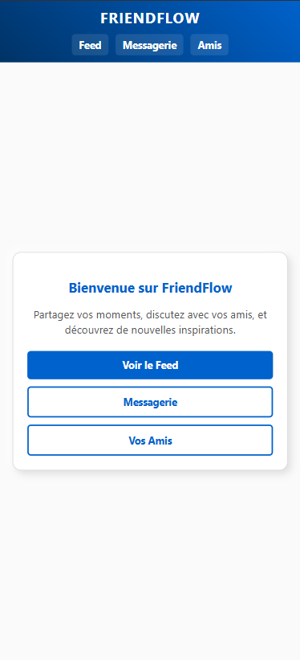

# Friendflow

Bienvenue sur **Friendflow**, le nouveau réseau social à la mode !

Pour utiliser ce petit réseau social, rien de plus simple :

Clonez le dépôt avec la commande dans votre terminal git clone

Profitez ensuite de toutes les fonctionnalités !

À noter :
J’ai volontairement créé des branches pour chaque page, puis j’ai fait des merges sur la branche main (ce qui n’est pas une bonne pratique en prod) afin de vous montrer que je suis à l’aise avec Git et la gestion des branches.
Je me suis permis de continuer sur la branche main, car il s’agit d’un petit projet.
Pour rendre le projet accessible via une IHM, j'ai utilisé Laragon, ce qui m'a permis de travailler plus efficacement et rapidement.

## Fonctionnalités Réalisées dans les grandes lignes : 
# feed
- Affichage des Posts depuis un fichier JSON ( post JSON )
- Réactions aux Posts avec animations
- Ajout et visualisation des commentaires
- Affichage des images en plein écran

# Messages
- Affichage du dernier message
- Détail d’une Conversation avec historique
- Envoi de nouveaux messages en temps réel
- fichier JSON conversation crée 

# Amis
- Liste d’Amis
- Barre de recherche pour filtrer les amis
- Lien direct vers la messagerie
- Drag & Drop (Pas reussi)

# Design responsive
- Style Neumorphique
- Interface adaptée à tous les appareils

# Git 
- repo crée 
- branches 
- merge 
- push commeté 

# Documentation
- Readme 

voici un appecue du projet : 

